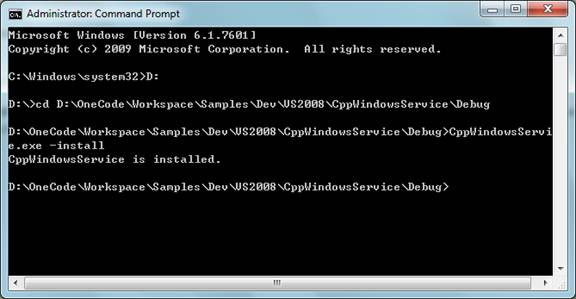

# A basic Windows service in C++ (CppWindowsService)

This project is based on the original one at [A basic Windows service in C++ (CppWindowsService)](https://github.com/microsoftarchive/msdn-code-gallery-microsoft/tree/master/OneCodeTeam/A%20basic%20Windows%20service%20in%20C%2B%2B%20(CppWindowsService)) published by [Microsoft Archive](https://github.com/microsoftarchive).

## Requires

- Visual Studio 2022

## License

- MS-LPL

## Technologies

- Windows SDK

## Topics

- Windows Service

## Updated

- 15/10/2024

## Description

## SERVICE APPLICATION

### Introduction

This code sample demonstrates creating a very basic Windows Service application in Visual C++. The example Windows Service logs the service start and stop information to the Application event log, and shows how to run the main function of the service in a thread pool worker thread. You can easily extend the Windows Service skeleton to meet your own business requirement.

### Running the Sample

The following steps walk through a demonstration of the Windows Service sample.

- **Step 1.** After you successfully build the sample project in Visual Studio 2022, you will get a service application: CppWindowsService.exe.
- **Step 2.** Run a command prompt as administrator, navigate to the output folder of the sample project, and enter the following command to install the service.

```bash
CppWindowsService.exe -install
```

The service is successfully installed if the process outputs:



If you do not see this output, please look for error codes in the output, and investigate the cause of failure. For example, the error code `0x431` means that the service already exists, and you need to uninstall it first.

- **Step 3.** Open Service Management Console (`services.msc`). You should be able to find `CppWindowsService Sample Service` in the service list.


- **Step 4.** Right-click the `CppWindowsService` service in Service Management Console and select Start to start the service. Open Event Viewer, and navigate to` Windows Logs >> Application`. You should be able to see this event from `CppWindowsService` with the information:


- **Step 5.** Right-click the service in Service Management Console and select Stop to stop the service. You will see this new event from `CppWindowsService` in `Event Viewer >> Windows Logs >> Application` with the information:


- **Step 6.** To uninstall the service, enter the following command in the command prompt running as administrator.

```bash
CppWindowsService.exe -remove
```

If the service is successfully removed, you would see this output:


### Using the Code

- **Step 1.** In Visual Studio 2022, add a new `Visual C++ >> Win32 >> Win32 Console Application` project named `CppWindowsService`. Unselect the `Precompiled header` option in Application Settings of the Win32 Application Wizard, and delete `stdafx.h`, `stdafx.cpp`, `targetver.h` files after the project is created.
- **Step 2.** Define the settings of the service in `CppWindowsService.cpp`.

```cpp
// Internal name of the service
#define SERVICE_NAME             L"CppWindowsService"

// Displayed name of the service
#define SERVICE_DISPLAY_NAME     L"CppWindowsService Sample Service"

// Service start options.
#define SERVICE_START_TYPE       SERVICE_DEMAND_START

// List of service dependencies - "dep1\0dep2\0\0"
#define SERVICE_DEPENDENCIES     L""

// The name of the account under which the service should run
#define SERVICE_ACCOUNT          L"NT AUTHORITY\\LocalService"

// The password to the service account name
#define SERVICE_PASSWORD         NULL
```

> ⚠️ **Security Note:** In this code sample, the service is configured to run as `LocalService`, instead of `LocalSystem`. The `LocalSystem` account has broad permissions. Use the `LocalSystem` account with caution, because it might increase your risk of attacks from malicious software. For tasks that do not need broad permissions, consider using the LocalService account, which acts as a non-privileged user on the local computer and presents anonymous credentials to any remote server.

- **Step 3.** Replace the application's entry point (main) in `CppWindowsService.cpp` with the code below. According to the arguments in the command line, the function installs or uninstalls or starts the service by calling into different routines that will be declared and implemented in the next steps.

```cpp
int wmain(int argc, wchar_t *argv[])
{
    if ((argc &gt; 1) && ((*argv[1] == L'-' || (*argv[1] == L'/'))))
    {
        if (_wcsicmp(L"install", argv[1] &#43; 1) == 0)
        {
            // Install the service when the command is
            // "-install" or "/install".
            InstallService(
                SERVICE_NAME,               // Name of service
                SERVICE_DISPLAY_NAME,       // Name to display
                SERVICE_START_TYPE,         // Service start type
                SERVICE_DEPENDENCIES,       // Dependencies
                SERVICE_ACCOUNT,            // Service running account
                SERVICE_PASSWORD            // Password of the account
                );
        }
        else if (_wcsicmp(L"remove", argv[1] &#43; 1) == 0)
        {
            // Uninstall the service when the command is
            // "-remove" or "/remove".
            UninstallService(SERVICE_NAME);
        }
    }
    else
    {
        wprintf(L"Parameters:\n");
        wprintf(L" -install  to install the service.\n");
        wprintf(L" -remove   to remove the service.\n");

        CSampleService service(SERVICE_NAME);
        if (!CServiceBase::Run(service))
        {
            wprintf(L"Service failed to run w/err 0x%08lx\n", GetLastError());
        }
    }

    return 0;
}
```

- **Step 4.** Add the `ServiceBase.h` and `ServiceBase.cpp` files to provide a base class for a service that will exist as part of a service application. The class is named `CServiceBase`. It must be derived from when creating a new service class. The service base class has these public functions:

```cpp
// It register the executable for a service with SCM.
static BOOL CServiceBase::Run(CServiceBase &service)

// This is the constructor of the service class. The optional parameters
// (fCanStop, fCanShutdown and fCanPauseContinue) allow you to specify
// whether the service can be stopped, paused and continued, or be
// notified when system shutdown occurs.
CServiceBase::CServiceBase(PWSTR pszServiceName,
    BOOL fCanStop = TRUE,
    BOOL fCanShutdown = TRUE,
    BOOL fCanPauseContinue = FALSE)

// This is the virtual destructor of the service class.
virtual ~CServiceBase::CServiceBase(void);

// Funtion that stops the service.
void CServiceBase::Stop();
```

The class also provides these virtual member functions. You can implement them in a derived class. The functions execute when the service starts, stops, pauses, resumes, and when the system is shutting down.

```cpp
virtual void OnStart(DWORD dwArgc, PWSTR *pszArgv);
virtual void OnStop();
virtual void OnPause();
virtual void OnContinue();
virtual void OnShutdown();
```

- **Step 5.** Add the `SampleService.h` and `SampleService.cpp` files to provide a sample service class that derives from the service base class - `CServiceBase`. The sample service logs the service start and stop information to the Application log, and shows how to run the main function of the service in a thread pool worker thread.

`CSampleService::OnStart`, which is executed when the service starts, calls `CServiceBase::WriteEventLogEntry` to log the service-start information. And it calls `CThreadPool::QueueUserWorkItem` to queue the main service function (`CSampleService::ServiceWorkerThread`)
for execution in a worker thread.

> ⚠️ **NOTE:** A service application is designed to be long running. Therefore, it usually polls or monitors something in the system. The monitoring is set up in the `OnStart` method. However, `OnStart` does not actually do the monitoring. The `OnStart` method must return to the operating system after the service's operation has begun. It must not loop forever or block. To set up a simple monitoring mechanism, one general solution is to create a timer in `OnStart`. The timer would then raise events in your code periodically, at which time your service could do its monitoring. The other solution is to spawn a new thread to perform the main service functions, which is demonstrated in this code sample.

```cpp
void CSampleService::OnStart(DWORD dwArgc, LPWSTR *lpszArgv)
{
    // Log a service start message to the Application log.
    WriteEventLogEntry(L"CppWindowsService in OnStart",
        EVENTLOG_INFORMATION_TYPE);

    // Queue the main service function for execution in a worker thread.
    CThreadPool::QueueUserWorkItem(&CSampleService::ServiceWorkerThread, this);
}
```

`CSampleService::OnStop`, which is executed when the service stops, calls `CServiceBase::WriteEventLogEntry` to log the service-stop information. Next, it sets the member variable `m_fStopping` as `TRUE` to indicate that the service is stopping and waits for the finish
of the main service function that is signaled by the `m_hStoppedEvent` event object.

```cpp
void CSampleService::OnStop()
{
    WriteEventLogEntry(L"CppWindowsService in OnStop",
        EVENTLOG_INFORMATION_TYPE);

    // Indicate that the service is stopping and wait for the finish of the
    // main service function (ServiceWorkerThread).
    m_fStopping = TRUE;
    if (WaitForSingleObject(m_hStoppedEvent, INFINITE) != WAIT_OBJECT_0)
    {
        throw GetLastError();
    }
}
```

`CSampleService::ServiceWorkerThread` runs in a thread pool worker thread. It performs the main function of the service such as the communication with client applications through a named pipe. In order that the main function finishes gracefully when the service is about to stop, it should periodically check the `m_fStopping` variable. When the function detects that the service is stopping, it cleans up the work and signal the `m_hStoppedEvent` event object.

```cpp
void CSampleService::ServiceWorkerThread(void)
{
    // Periodically check if the service is stopping.
    while (!m_fStopping)
    {
        // Perform main service function here...

        ::Sleep(2000);  // Simulate some lengthy operations.
    }

    // Signal the stopped event.
    SetEvent(m_hStoppedEvent);
}
```

```bash
InstallService Installs the service
UninstallService Uninstalls the service
```

### More Information

- [MSDN: About Services](<http://msdn.microsoft.com/en-us/library/ms681921(VS.85).aspx>)
- [MSDN: The Complete Service Sample](<http://msdn.microsoft.com/en-us/library/bb540476(VS.85).aspx>)
- [MSDN: Creating a Simple Win32 Service in C++](http://msdn.microsoft.com/en-us/library/ms810429.aspx)
